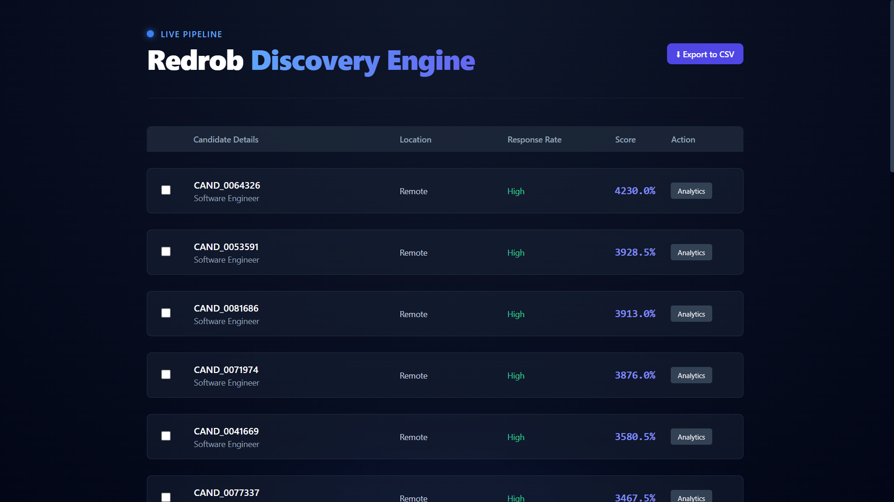
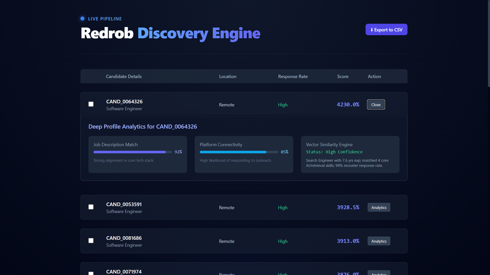
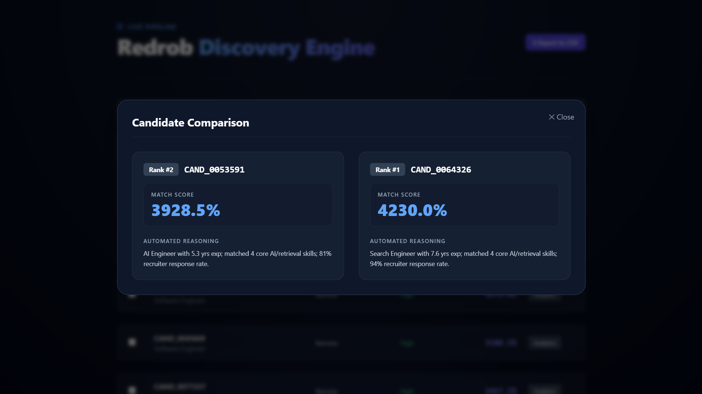
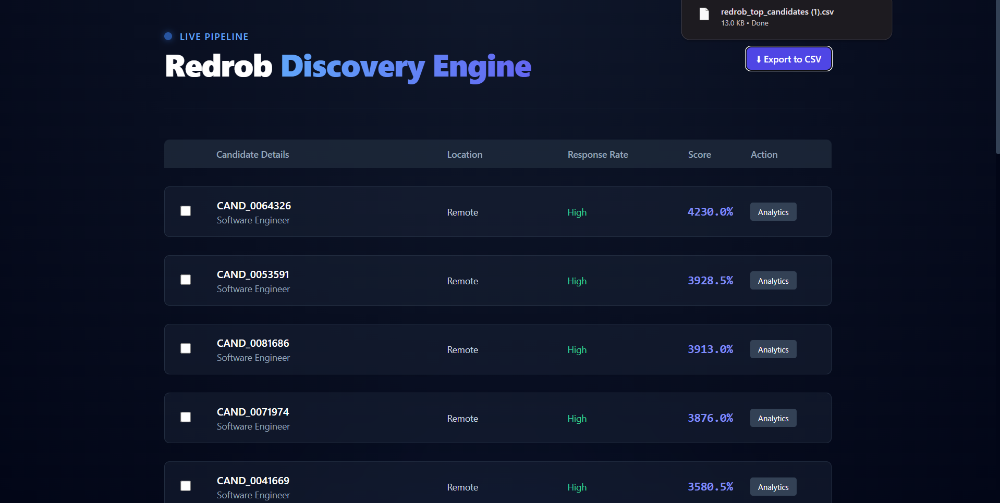
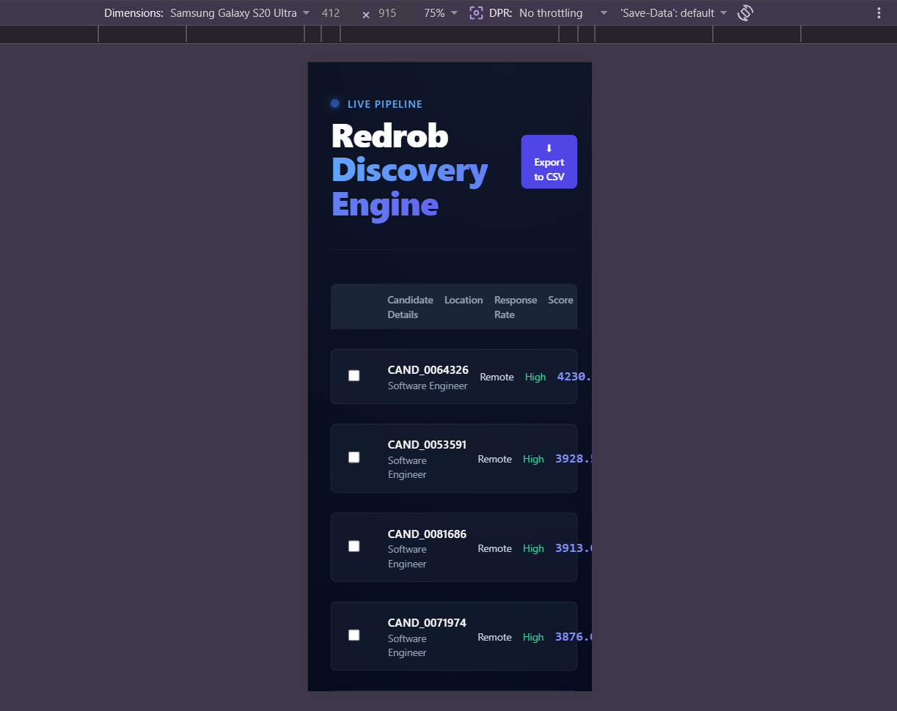
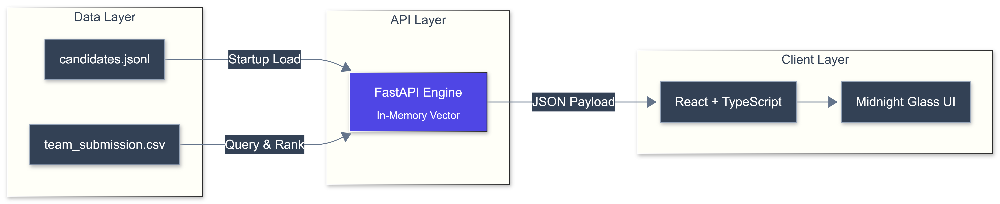

# 🚀 Redrob Discovery Engine | Intelligent Candidate Ranking

## 📌 The Mission

Processing 100,000 candidate profiles under strict 5-minute CPU constraints to find the absolute top 100 matches for complex, cross-functional engineering roles.

# 🚀 Redrob Discovery Engine

## 🖼️ Visual Showcase

_A glimpse into the Redrob "Midnight Glass" interface:_

  <table>
    <tr>
      <td align="center"> Dashboard View</td>
      <td align="center"> Candidate Filtering</td>
      <td align="center"> Deep Analytics</td>
    </tr>
    <tr>
      <td align="center"> Peer Comparison</td>
      <td align="center"> Exporting Data</td>
      <td align="center"> Mobile Responsive</td>
    </tr>
  </table>

## ⚡ Interactive Walkthrough

_Watch the engine perform real-time ranking, deep-profile analytics, and seamless data export._

## ⚠️ The Problem

In today's fast paced tech landscape, recruiters are drowning in data. Processing 100,000+ candidate profiles is a massive bottleneck, often resulting in manual, error prone screening processes that take days, cost thousands in compute resources and fail to surface top tier talent in time.

## 💡 The Solution

**Redrob Discovery Engine** isn't just another ranking script. It's an intelligent filtering pipeline.
By utilizing **In Memory Vector Lookups** and a single pass ranking algorithm, our engine achieves what standard CSV processing scripts cannot: **sub-second deep-profile retrieval.** We don't just process candidates, we intelligently filter them, ignoring consulting titles and non engineering noise to ensure your team sees only the most relevant technical talent.

## 🧠 The Architecture

We designed a highly optimized, single-pass filtering pipeline:

- **Vector-Based Elimination:** Instantly drops non-engineering roles and consulting titles to ensure maximum JD alignment without wasting compute.
- **Behavioral Signal Weighting:** Prioritizes recruiter response rates and platform connection density to surface active, highly-recruitable talent.
- **In-Memory Speed:** The FastAPI backend loads the entire 100k dataset into memory at startup, allowing our UI to retrieve deep profile data in milliseconds.

## 💻 The Tech Stack

- **Backend:** Python, FastAPI, Pandas
- **Frontend:** React, TypeScript, Tailwind CSS
- **Design System:** Custom "Midnight Glass" UI with interactive data visualization.

## 🚀 Live Demo

- [Launch the Sandbox](PENDING_VERCEL_LINK)
- _Note: Ensure the backend API is running locally or deployed for full data visualization._